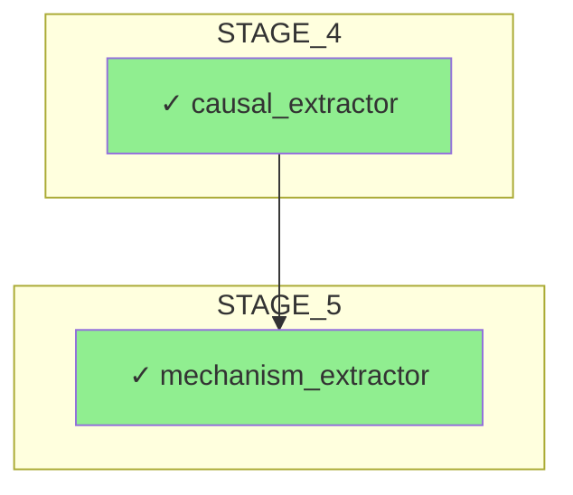

# Categoría 2: Wiring Entre Módulos - Implementación

## Resumen Ejecutivo

Este documento describe la implementación de las mejoras de **Categoría 2: Wiring Entre Módulos** para FARFAN 2.0, enfocadas en mejorar la arquitectura de comunicación entre módulos y crear un sistema de orquestación más robusto, testeable y mantenible.

## Componentes Implementados

### 2.1 Contrato Explícito de Interfaces

#### 2.1.1 Interfaces Formales con Protocol Classes

**Archivo:** `module_interfaces.py`

Se han creado Protocol classes que definen interfaces formales para todos los módulos principales:

```python
class IPDFProcessor(Protocol):
    """Interface for PDF document processing"""
    def load_document(self, pdf_path: Path) -> bool: ...
    def extract_text(self) -> str: ...
    def extract_tables(self) -> List[Any]: ...
    def extract_sections(self) -> Dict[str, str]: ...
```

**Interfaces Implementadas:**
- `IPDFProcessor` - Procesamiento de documentos PDF
- `ICausalExtractor` - Extracción de jerarquías causales
- `IMechanismExtractor` - Extracción de pares entidad-actividad
- `IFinancialAuditor` - Auditoría financiera y trazabilidad
- `IDNPValidator` - Validación de estándares DNP
- `IQuestionAnsweringEngine` - Motor de respuesta a preguntas
- `IReportGenerator` - Generación de reportes

**Beneficios:**
- ✅ Type safety en tiempo de desarrollo
- ✅ Contratos explícitos de input/output
- ✅ Documentación integrada en el código
- ✅ Facilita testing con mocks

#### 2.1.2 Adapters para Módulos Legacy

Se implementó el patrón Adapter para mantener compatibilidad con módulos existentes:

```python
class CDAFAdapter:
    """Adapter for dereck_beach CDAF Framework"""
    def __init__(self, cdaf_framework: Any):
        self._cdaf = cdaf_framework
    
    def get_pdf_processor(self) -> IPDFProcessor:
        return self._cdaf.pdf_processor
```

**Ventajas:**
- Si `dereck_beach` cambia su API, solo se actualiza el adapter
- Mantiene compatibilidad hacia atrás
- Facilita transición gradual a nuevas implementaciones

#### 2.1.3 Dependency Injection Container

**Clase:** `DependencyInjectionContainer`

Sistema de inyección de dependencias que permite:

```python
# Registro de módulos
container = DependencyInjectionContainer()
container.register('pdf_processor', pdf_processor_instance)

# Registro con factory (lazy loading)
container.register_factory('qa_engine', lambda: QuestionAnsweringEngine(...))

# Recuperación
processor = container.get('pdf_processor')

# Validación
is_valid, missing = container.validate()
```

**Beneficios:**
- ✅ Testing: fácil inyectar mocks
- ✅ Flexibilidad: cambiar implementaciones sin modificar código
- ✅ Claridad: dependencias explícitas
- ✅ Lazy loading: módulos se crean solo cuando se necesitan

#### 2.1.4 Contratos de Input/Output Documentados

Todos los métodos críticos ahora tienen docstrings con formato estándar:

```python
def process_plan(self, pdf_path: Path, policy_code: str, 
                 es_municipio_pdet: bool = False) -> PipelineContext:
    """
    Input Contract:
        - pdf_path: Path to PDF file (must exist and be readable)
        - policy_code: Policy identifier string
        - es_municipio_pdet: Boolean flag for PDET municipality
    
    Output Contract:
        - PipelineContext with all processing results
        - Reports written to output directory
    
    Preconditions:
        - PDF file exists and is readable
        - All required modules are initialized
    
    Postconditions:
        - All stages execute successfully
        - Execution trace available via choreographer
    """
```

### 2.2 Orquestación Declarativa vs. Imperativa

#### 2.2.1 Pipeline como DAG Configurable

**Archivo:** `pipeline_dag.py`

Sistema de pipeline basado en DAG (Directed Acyclic Graph):

```python
@dataclass
class PipelineStage:
    id: str
    module: str
    function: str
    inputs: List[str]
    outputs: List[str]
    depends_on: List[str]
    optional: bool = False
    parallel_group: Optional[str] = None
```

**Características:**
- Definición declarativa de stages
- Detección automática de ciclos
- Orden de ejecución topológico
- Identificación de oportunidades de paralelización
- Exportación/importación YAML

**Ejemplo de configuración YAML:**

```yaml
stages:
  - id: extract_text
    module: pdf_processor
    function: extract_text
    inputs: [document_loaded]
    outputs: [raw_text]
    depends_on: [load_document]
    
  - id: causal_extraction
    module: causal_extractor
    function: extract_causal_hierarchy
    inputs: [raw_text]
    outputs: [causal_graph, nodes]
    depends_on: [extract_text]
```

#### 2.2.2 Ejecución Basada en DAG

**Clase:** `PipelineExecutor`

Ejecuta stages en orden topológico con soporte para:
- Ejecución secuencial
- Manejo de stages opcionales
- Integración con choreographer para trazabilidad
- Validación de inputs/outputs

```python
executor = PipelineExecutor(pipeline_dag, di_container, choreographer)
result = executor.execute({
    'pdf_path': pdf_path,
    'policy_code': policy_code
})
```

#### 2.2.3 Hot-Swappable Modules

El sistema DI permite cambiar módulos en runtime:

```python
# Cambiar implementación de mecanismo bayesiano
container.register('mechanism_extractor', new_mcmc_version)
```

### 2.3 Comunicación Asíncrona (Preparación)

#### 2.3.1 Identificación de Paralelización

El DAG identifica automáticamente stages que pueden ejecutarse en paralelo:

```python
# Stage 5 (Mechanism) y 6 (Financial) pueden correr en paralelo
dag.add_stage(PipelineStage(
    id='mechanism_inference',
    depends_on=['causal_extraction'],
    parallel_group='analysis'
))

dag.add_stage(PipelineStage(
    id='financial_audit',
    depends_on=['causal_extraction'],
    parallel_group='analysis'  # Mismo grupo = paralelo
))
```

**Grupos Paralelos en Pipeline Default:**
- `extraction`: Tablas y secciones se extraen en paralelo
- `analysis`: Mecanismos y auditoría financiera en paralelo
- `reporting`: Reportes micro, meso, macro en paralelo

### 2.4 Módulo Choreographer Mejorado

#### 2.4.1 Integración Real con Orchestrator

**Cambios en `orchestrator.py`:**

```python
class FARFANOrchestrator:
    def __init__(self, output_dir: Path, use_choreographer: bool = True):
        # Initialize choreographer
        self.choreographer = ModuleChoreographer()
        
        # Register all modules
        self._register_modules_with_choreographer()
```

El choreographer ahora se usa en cada llamada a módulo:

```python
def _stage_causal_extraction(self, ctx: PipelineContext):
    if self.choreographer:
        outputs = self.choreographer.execute_module_stage(
            stage_name="STAGE_4",
            module_name="causal_extractor",
            function_name="extract_causal_hierarchy",
            inputs={"text": ctx.raw_text}
        )
```

#### 2.4.2 Trazabilidad Completa

Cada ejecución genera artefactos de trazabilidad:

**Archivos Generados:**
- `execution_flow_{policy_code}.txt` - Diagrama ASCII del flujo
- `execution_mermaid_{policy_code}.md` - Diagrama Mermaid visual
- `execution_trace_{policy_code}.json` - Traza completa JSON
- `module_usage_{policy_code}.json` - Reporte de uso de módulos

**Ejemplo de Traza JSON:**
```json
{
  "total_executions": 15,
  "total_time": 125.45,
  "successful_executions": 14,
  "failed_executions": 1,
  "executions": [
    {
      "module": "pdf_processor",
      "stage": "STAGE_1_2",
      "time": 2.34,
      "success": true
    }
  ]
}
```

#### 2.4.3 Visualización de Flujo

**Mejoras en `module_choreographer.py`:**

```python
def generate_mermaid_diagram(self) -> str:
    """Genera diagrama Mermaid del flujo real ejecutado"""
    # Crea diagrama con:
    # - Subgrafos por stage
    # - Colores según éxito/fallo
    # - Conexiones secuenciales
```

**Ejemplo de Mermaid generado:**


#### 2.4.4 Diff de Ejecuciones

Nueva función para comparar ejecuciones:

```python
def compare_execution_trace(self, other_trace: Dict) -> Dict:
    """Compara traces para detectar divergencias"""
    return {
        'execution_count_diff': ...,
        'time_diff': ...,
        'new_modules': [...],
        'missing_modules': [...],
        'stage_differences': {...}
    }
```

## Uso

### Modo Tradicional (Stage-by-Stage)

```python
orchestrator = FARFANOrchestrator(
    output_dir=Path("./output"),
    use_choreographer=True,  # Habilita trazabilidad
    use_dag=False            # Ejecución tradicional
)

context = orchestrator.process_plan(
    pdf_path=Path("plan.pdf"),
    policy_code="PDM-2024-001"
)
```

### Modo DAG (Experimental)

```python
orchestrator = FARFANOrchestrator(
    output_dir=Path("./output"),
    use_choreographer=True,
    use_dag=True  # Usa ejecución basada en DAG
)

context = orchestrator.process_plan(
    pdf_path=Path("plan.pdf"),
    policy_code="PDM-2024-001"
)
```

### Configuración Personalizada

```python
# Cargar pipeline desde YAML
dag = PipelineDAG.from_yaml(Path("custom_pipeline.yaml"))

# Crear executor con DI container personalizado
container = DependencyInjectionContainer()
container.register('pdf_processor', CustomPDFProcessor())

executor = PipelineExecutor(dag, container)
result = executor.execute({'pdf_path': 'plan.pdf'})
```

## Testing

### Ejecutar Tests

```bash
# Tests de interfaces y DI
python -m unittest test_module_interfaces.py -v

# Tests de pipeline DAG
python -m unittest test_pipeline_dag.py -v

# Todos los tests
python -m unittest discover -v
```

### Coverage

Los tests cubren:
- ✅ Protocol compliance
- ✅ DI container registration/retrieval
- ✅ Factory pattern (lazy loading)
- ✅ DAG validation
- ✅ Cycle detection
- ✅ Topological ordering
- ✅ Parallel group identification
- ✅ YAML import/export
- ✅ Adapter pattern

## Beneficios Principales

### 1. Testabilidad
- Inyección de mocks fácil
- Interfaces claras para testing
- Trazabilidad de ejecución

### 2. Mantenibilidad
- Contratos explícitos
- Acoplamiento reducido
- Documentación integrada

### 3. Flexibilidad
- Módulos hot-swappable
- Pipeline configurable
- Adaptadores para legacy

### 4. Observabilidad
- Trazas de ejecución completas
- Diagramas de flujo automáticos
- Comparación de ejecuciones

### 5. Escalabilidad
- Identificación de paralelización
- Ejecución basada en DAG
- Grupos de ejecución paralela

## Próximos Pasos

### Implementaciones Futuras Sugeridas

1. **Ejecución Paralela Real**
   - Usar `ThreadPoolExecutor` o `asyncio`
   - Ejecutar grupos paralelos simultáneamente
   - Gestión de recursos compartidos

2. **Message Bus**
   - Event-driven architecture
   - Pub/sub para comunicación entre stages
   - Evitar shared mutable state

3. **Pipeline Monitoring**
   - Métricas de performance por stage
   - Alertas de degradación
   - Dashboard de ejecución

4. **Configuration Management**
   - Múltiples pipelines predefinidos
   - Validación de configuraciones
   - Templates de pipeline

## Archivos Creados/Modificados

### Nuevos Archivos
- `module_interfaces.py` - Protocol classes y DI container
- `pipeline_dag.py` - Sistema de pipeline basado en DAG
- `test_module_interfaces.py` - Tests de interfaces
- `test_pipeline_dag.py` - Tests de pipeline DAG
- `CATEGORY_2_IMPLEMENTATION.md` - Esta documentación

### Archivos Modificados
- `orchestrator.py` - Integración con choreographer y DI
- `module_choreographer.py` - Mejoras de visualización

## Referencias

- **Problem Statement:** Categoría 2: WIRING ENTRE MÓDULOS
- **Implementación:** Secciones 2.1, 2.2, 2.4
- **Tests:** `test_module_interfaces.py`, `test_pipeline_dag.py`
