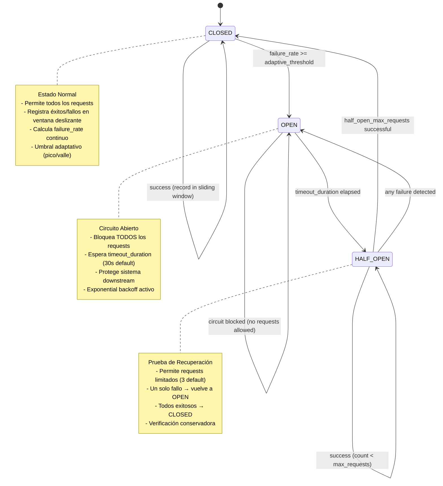
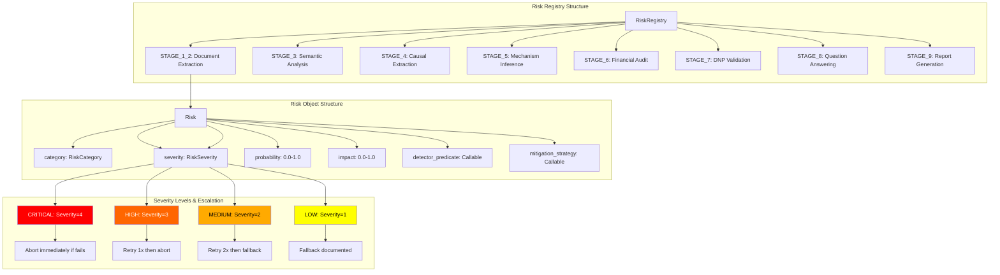

# FARFAN-2.0

**Framework Avanzado de Reconstrucción y Análisis de Formulaciones de Acción Nacional 2.0**

[](https://www.python.org/downloads/)
[](LICENSE)
[](CI_ENFORCEMENT_README.md)
[](CONTRIBUTING.md)

## 📋 Tabla de Contenidos

- [Descripción](#-descripción)
- [CI Contract Enforcement](#-ci-contract-enforcement)
- [Arquitectura de Resiliencia](#arquitectura-de-resiliencia-risk-driven-resilience-system)
- [Características Principales](#características-principales)
- [Instalación](#-instalación)
- [Uso Avanzado y Configuración](#-uso-avanzado-y-configuración)
- [Inicio Rápido](#-inicio-rápido)
- [Módulos del Sistema](#-módulos-del-sistema)
- [Documentación](#-documentación)
- [Estándares y Normativa](#-estándares-y-normativa)
- [Contribuciones](#-contribuciones)
- [Licencia](#-licencia)
- [Contacto y Soporte](#-contacto-y-soporte)

## 📖 Descripción

FARFAN-2.0 es un **framework de grado industrial** para la deconstrucción y auditoría causal de Planes de Desarrollo Territorial en Colombia, con énfasis en cumplimiento riguroso de estándares del **DNP (Departamento Nacional de Planeación)**.

### Capacidades Principales

- ✅ **Análisis Causal Automatizado**: Extracción y validación de cadenas causales desde documentos PDF
- ✅ **Evaluación de 300 Preguntas**: Sistema completo de evaluación mediante 30 preguntas base × 10 áreas de política
- ✅ **Cumplimiento DNP**: Validación automática de competencias municipales, indicadores MGA y lineamientos PDET
- ✅ **Resiliencia Distribuida**: Circuit breakers, retry handlers, y recovery checkpoints
- ✅ **Auditoría Completa**: Trazabilidad financiera y generación de reportes multinivel (micro, meso, macro)

## 🛡️ CI Contract Enforcement

FARFAN 2.0 implementa un sistema de **CI Contract Enforcement** que bloquea automáticamente cualquier PR que introduzca ambiguedad, elimine contratos, o siga patrones mediocres.

### Enforcement Gates (Automatic Merge Blocking)

1. **Orchestrator Contract Validation**
   - ❌ Bloquea si faltan aserciones en métodos de fase
   - ❌ Bloquea si falta logging de auditoría
   - ❌ Bloquea si falta PhaseResult estructurado

2. **Git Diff Contract Analysis**
   - ❌ Bloquea si se eliminan aserciones sin `SIN_CARRETA-RATIONALE`
   - ❌ Bloquea si se elimina telemetría sin documentación
   - ❌ Bloquea si se eliminan contratos sin alternativa más fuerte

3. **Governance Standards Tests**
   - ❌ Bloquea si fallan las pruebas metodológicas
   - ❌ Bloquea si se viola la inmutabilidad del audit log
   - ❌ Bloquea si no se cumplen estándares de aislamiento

4. **Review Requirements**
   - ❌ Bloquea cambios al orchestrator sin etiqueta `sin-carreta/approver`
   - ❌ Bloquea cambios a infraestructura sin revisión requerida
   - ❌ Bloquea cambios a calibración sin documentación

### SIN_CARRETA Doctrine

**SIN_CARRETA** (sin atajos) es nuestra filosofía fundamental:

- ✅ **NO código best-effort silencioso** - Todos los errores deben ser explícitos
- ✅ **NO magia o fallbacks implícitos** - Todo comportamiento debe ser determinista
- ✅ **NO eliminación de contratos** - Deben reemplazarse con alternativas más fuertes
- ✅ **NO ambigüedad** - Todo código debe tener comportamiento claro y verificable

### Cómo Contribuir

Ver [CONTRIBUTING.md](CONTRIBUTING.md) para guías completas sobre:
- Desarrollo con enforcement activo
- Documentación de rationale (SIN_CARRETA-RATIONALE)
- Proceso de revisión y aprobación
- Requisitos de testing

Ver [CI_ENFORCEMENT_README.md](CI_ENFORCEMENT_README.md) para detalles del sistema de enforcement.


## Arquitectura de Resiliencia (Risk-Driven Resilience System)

FARFAN 2.0 implementa un sistema avanzado de resiliencia distribuida con patrones industriales para garantizar la robustez del pipeline de procesamiento. Este sistema incluye circuit breakers con ventanas deslizantes, evaluación de riesgos pre-ejecución, y recuperación incremental con checkpoints.

### Diagrama 1: Circuit Breaker - Transiciones de Estado con Ventana Deslizante

El Circuit Breaker protege contra fallos en cascada mediante tres estados con umbrales adaptativos según hora del día:



**Características de la Ventana Deslizante:**
- `window_size_seconds`: 60s (configurable)
- Limpieza automática de registros antiguos
- Cálculo de failure_rate en tiempo real
- Umbrales adaptativos:
  - **Horas pico** (8-18h): threshold × 1.5 (mayor tolerancia)
  - **Horas valle**: threshold × 0.8 (menor tolerancia)

### Diagrama 2: Risk Registry - Estructura con Niveles de Severidad

El Risk Registry organiza riesgos por etapa del pipeline con detectores y estrategias de mitigación:



**Categorías de Riesgo por Etapa:**
- **STAGE_1_2**: PDF_CORRUPTED, PDF_UNREADABLE, MISSING_SECTIONS, EMPTY_DOCUMENT
- **STAGE_3**: NLP_MODEL_UNAVAILABLE, TEXT_TOO_SHORT, ENCODING_ERROR
- **STAGE_4**: NO_CAUSAL_CHAINS, GRAPH_DISCONNECTED, INSUFFICIENT_NODES
- **STAGE_5**: BAYESIAN_INFERENCE_FAILURE, INSUFFICIENT_OBSERVATIONS
- **STAGE_6**: MISSING_BUDGET_DATA, BUDGET_INCONSISTENCY, NEGATIVE_ALLOCATIONS
- **STAGE_7**: DNP_STANDARDS_VIOLATION, COMPETENCIA_MISMATCH, MISSING_MGA_INDICATORS
- **STAGE_8**: INSUFFICIENT_EVIDENCE, MODULE_UNAVAILABLE
- **STAGE_9**: REPORT_GENERATION_FAILURE, DATA_SERIALIZATION_ERROR

### Diagrama 3: Flujo de Mitigación con Políticas de Escalación

El sistema ejecuta mitigación con retry adaptativo basado en severidad:


**Exponential Backoff para Dependencias Externas:**
- Intento 1: 0s delay
- Intento 2: 2^1 = 2s delay
- Intento 3: 2^2 = 4s delay
- Máximo: 30s delay con jitter aleatorio ±20%

### Diagrama 4: Checkpoint Recovery - Estados Incrementales Delta

El sistema persiste estados intermedios para recuperación sin re-procesamiento completo:


**Ventajas del Sistema de Checkpoints:**
- **Recuperación rápida**: Re-inicia desde último checkpoint exitoso
- **Estados delta**: Solo persiste cambios incrementales (ahorra espacio)
- **Integridad**: Validación de checksums y dependencias
- **Inmutabilidad**: Checkpoints son read-only después de creación

### Diagrama 5: Pipeline Completo con Risk Assessment Gates

Flujo completo del pipeline con gates de evaluación de riesgos pre-ejecución:

```mermaid
flowchart TB
    START([Input: PDF Document])
    START --> INIT[Initialize PipelineContext<br/>+ RiskRegistry<br/>+ CircuitBreaker]
    
    INIT --> GATE1{Risk Gate 1}
    GATE1 -->|Pass| S1[STAGE 1-2:<br/>Document Extraction<br/>+ Table Parsing]
    GATE1 -->|CRITICAL/HIGH Risk| ABORT1[Abort or Retry]
    
    S1 --> CB1{Circuit Breaker<br/>Check}
    CB1 -->|CLOSED| CP1[(Checkpoint 1)]
    CB1 -->|OPEN| WAIT1[Wait + Exponential Backoff]
    WAIT1 --> CB1
    
    CP1 --> GATE3{Risk Gate 3}
    GATE3 -->|Pass| S3[STAGE 3:<br/>Semantic Analysis<br/>NLP + spaCy]
    GATE3 -->|Risk Detected| MIT3[Mitigate<br/>Risk]
    MIT3 --> S3
    
    S3 --> CB3{Circuit Breaker}
    CB3 -->|CLOSED| CP2[(Checkpoint 2)]
    CB3 -->|OPEN/HALF_OPEN| BACKOFF3[Backoff]
    BACKOFF3 --> CB3
    
    CP2 --> GATE4{Risk Gate 4}
    GATE4 --> S4[STAGE 4:<br/>Causal Extraction<br/>Graph Construction]
    
    S4 --> CP3[(Checkpoint 3)]
    CP3 --> GATE5{Risk Gate 5}
    GATE5 --> S5[STAGE 5:<br/>Mechanism Inference<br/>Bayesian Analysis]
    
    S5 --> CP4[(Checkpoint 4)]
    CP4 --> GATE6{Risk Gate 6}
    GATE6 --> S6[STAGE 6:<br/>Financial Audit<br/>Budget Traceability]
    
    S6 --> CP5[(Checkpoint 5)]
    CP5 --> GATE7{Risk Gate 7}
    GATE7 --> S7[STAGE 7:<br/>DNP Validation<br/>Competencias + MGA + PDET]
    
    S7 --> CP6[(Checkpoint 6)]
    CP6 --> GATE8{Risk Gate 8}
    GATE8 --> S8[STAGE 8:<br/>Question Answering<br/>300 Questions]
    
    S8 --> CP7[(Checkpoint 7)]
    CP7 --> GATE9{Risk Gate 9}
    GATE9 --> S9[STAGE 9:<br/>Report Generation<br/>Micro/Meso/Macro]
    
    S9 --> VALIDATE[Validate All Outputs]
    VALIDATE --> END([Output: Reports + Diagrams])
    
    ABORT1 --> FAIL([Pipeline Failed])
    
    style GATE1 fill:#FFE4B5
    style GATE3 fill:#FFE4B5
    style GATE4 fill:#FFE4B5
    style GATE5 fill:#FFE4B5
    style GATE6 fill:#FFE4B5
    style GATE7 fill:#FFE4B5
    style GATE8 fill:#FFE4B5
    style GATE9 fill:#FFE4B5
    
    style CB1 fill:#87CEEB
    style CB3 fill:#87CEEB
    
    style CP1 fill:#90EE90
    style CP2 fill:#90EE90
    style CP3 fill:#90EE90
    style CP4 fill:#90EE90
    style CP5 fill:#90EE90
    style CP6 fill:#90EE90
    style CP7 fill:#90EE90
```



### Configuración del Sistema de Resiliencia

```python
from circuit_breaker import CircuitBreaker
from risk_mitigation_layer import RiskRegistry, RiskMitigationLayer, Risk, RiskSeverity, RiskCategory

# 1. Configurar Circuit Breaker
circuit_breaker = CircuitBreaker(
    failure_threshold=0.5,          # 50% failure rate para abrir circuito
    window_size_seconds=60,         # Ventana deslizante de 60 segundos
    timeout_duration=30,            # 30s en OPEN antes de HALF_OPEN
    half_open_max_requests=3,       # 3 requests de prueba en HALF_OPEN
    operation_timeout=10.0,         # 10s timeout por operación
    peak_hours=[8,9,10,11,12,13,14,15,16,17,18],  # Horas pico
    peak_multiplier=1.5,            # Mayor tolerancia en horas pico
    off_peak_multiplier=0.8         # Menor tolerancia en horas valle
)

# 2. Configurar Risk Registry
registry = RiskRegistry()

# Registrar riesgo de ejemplo
pdf_corrupted_risk = Risk(
    category=RiskCategory.PDF_CORRUPTED,
    severity=RiskSeverity.CRITICAL,
    probability=0.1,
    impact=1.0,
    detector_predicate=lambda ctx: not ctx.raw_text or len(ctx.raw_text) < 100,
    mitigation_strategy=lambda ctx: repair_pdf(ctx.pdf_path),
    description="PDF corrupto o ilegible"
)

registry.register_risk("STAGE_1_2", pdf_corrupted_risk)

# 3. Inicializar Risk Mitigation Layer
mitigation_layer = RiskMitigationLayer(registry)

# 4. Ejecutar etapa con protección completa
result = mitigation_layer.wrap_stage_execution(
    stage="STAGE_1_2",
    stage_function=extract_document_text,
    context=pipeline_context
)

# 5. Obtener estadísticas
circuit_stats = circuit_breaker.get_window_stats()
mitigation_report = mitigation_layer.get_mitigation_report()
```

### Beneficios del Sistema de Resiliencia

1. **Alta Disponibilidad**: Circuit breakers previenen fallos en cascada
2. **Recuperación Automática**: Retry con exponential backoff para dependencias transitorias
3. **Degradación Graciosa**: Fallback documentado para riesgos LOW/MEDIUM
4. **Trazabilidad Completa**: Logging estructurado de todos los eventos de riesgo
5. **Eficiencia**: Checkpoints evitan re-procesamiento completo tras fallos
6. **Observabilidad**: Métricas detalladas de salud del sistema

## Características Principales

### 1. **NUEVO: Sistema de Evaluación de 300 Preguntas**

El orquestador implementa un sistema completo de evaluación mediante **300 preguntas causales**:

- **30 Preguntas Base**: Organizadas en 6 dimensiones del Marco Lógico
  - D1: Insumos (Diagnóstico y Líneas Base)
  - D2: Actividades (Formalizadas)
  - D3: Productos (Verificables)
  - D4: Resultados (Medibles)
  - D5: Impactos (Largo Plazo)
  - D6: Causalidad (Teoría de Cambio)

- **10 Áreas de Política** (Decálogo):
  - P1: Derechos de las mujeres e igualdad de género
  - P2: Prevención de la violencia y protección frente al conflicto
  - P3: Ambiente sano, cambio climático, prevención y atención a desastres
  - P4: Derechos económicos, sociales y culturales
  - P5: Derechos de las víctimas y construcción de paz
  - P6: Derecho al buen futuro de la niñez, adolescencia, juventud
  - P7: Tierras y territorios
  - P8: Líderes y defensores de derechos humanos
  - P9: Crisis de derechos de personas privadas de la libertad
  - P10: Migración transfronteriza

**Cada respuesta incluye**:
- Texto de respuesta directa
- Argumento de nivel doctoral (2+ párrafos)
- Nota cuantitativa (0.0-1.0)
- Evidencia del documento
- Módulos que contribuyeron

**Reportes a 3 Niveles**:
1. **MICRO**: 300 respuestas individuales
2. **MESO**: 4 clústeres × 6 dimensiones
3. **MACRO**: Alineación global + análisis retrospectivo/prospectivo

### 2. Framework CDAF (Causal Deconstruction and Audit Framework)
- Extracción automática de jerarquías causales desde PDFs
- Análisis de mecanismos causales (Entidad-Actividad)
- Trazabilidad financiera
- Auditoría de operacionalización
- Generación de diagramas causales y matrices de responsabilidad

### 3. **NUEVO: Cumplimiento Integral de Estándares DNP**

#### Competencias Municipales
- **17 competencias** catalogadas según normativa colombiana
- Validación automática de competencias propias y concurrentes
- Base legal completa (Ley 136/1994, Ley 715/2001, Ley 1551/2012)
- 14 sectores de intervención cubiertos

#### Indicadores MGA
- **51 indicadores** del catálogo oficial MGA
  - 28 indicadores de producto
  - 23 indicadores de resultado
- Fórmulas de cálculo oficiales
- Fuentes de información verificadas
- Alineación con ODS (Objetivos de Desarrollo Sostenible)

#### Lineamientos PDET
- **17 lineamientos** para los 170 municipios PDET
- **8 pilares** del Acuerdo de Paz implementados
- Validación especial de participación comunitaria
- Requisitos de inversión rural (>60%)
- Alineación con PATR subregionales

## 🚀 Instalación

### Requisitos Previos

| Requisito | Versión Mínima | Recomendado |
|-----------|----------------|-------------|
| **Python** | 3.11 | 3.12+ |
| **RAM** | 4GB | 8GB+ |
| **Espacio en Disco** | 2GB | 5GB+ |
| **Sistema Operativo** | Linux, macOS, Windows 10+ | Ubuntu 22.04+ |

**Herramientas adicionales:**
- Git (para clonar el repositorio)
- Graphviz (para generación de diagramas causales)

### Instalación Rápida (3 Pasos)

#### 1. Clonar el Repositorio

```bash
git clone https://github.com/kkkkknhh/FARFAN-2.0.git
cd FARFAN-2.0
```

#### 2. Instalar Dependencias

```bash
# Crear y activar entorno virtual (recomendado)
python3 -m venv farfan_env
source farfan_env/bin/activate  # En Linux/macOS
# farfan_env\Scripts\activate   # En Windows

# Actualizar pip e instalar dependencias
pip install --upgrade pip
pip install -r requirements.txt
```

#### 3. Descargar Modelo de Lenguaje Español

```bash
# Descargar modelo large de español (es_core_news_lg)
python -m spacy download es_core_news_lg
```

### Instalación de Dependencias Opcionales

#### Graphviz (para diagramas)

**Ubuntu/Debian:**
```bash
sudo apt-get update && sudo apt-get install graphviz
```

**macOS (con Homebrew):**
```bash
brew install graphviz
```

**Windows:**
- Descargar desde [graphviz.org/download](https://graphviz.org/download/)
- Agregar al PATH del sistema

#### OpenCV (para procesamiento avanzado de tablas)

Si usa `camelot-py` con backend CV:
```bash
# Ubuntu/Debian
sudo apt-get install python3-opencv

# macOS
brew install opencv

# Verificar instalación
python -c "import cv2; print('OpenCV OK')"
```

### Verificación de Instalación

```bash
# Verificar versión de Python
python --version  # Debe ser 3.11+

# Verificar dependencias core
python -c "import numpy, pandas, networkx, spacy; print('✓ Core dependencies OK')"

# Verificar modelo spaCy
python -c "import spacy; nlp = spacy.load('es_core_news_lg'); print('✓ spaCy model OK')"

# Verificar Graphviz (opcional)
python -c "import pydot; print('✓ Graphviz OK')"

# Ejecutar tests básicos
python -m pytest test_orchestrator.py -v
```

### Solución de Problemas Comunes

<details>
<summary><b>Error: "No module named 'torch_geometric'"</b></summary>

Para instalar `torch_geometric`, primero asegúrese de tener PyTorch instalado, luego:

```bash
pip install torch-scatter torch-sparse torch-cluster torch-spline-conv -f https://data.pyg.org/whl/torch-2.0.0+cpu.html
pip install torch-geometric
```
</details>

<details>
<summary><b>Error: "spaCy model 'es_core_news_lg' not found"</b></summary>

```bash
# Descargar e instalar el modelo manualmente
python -m spacy download es_core_news_lg

# O instalar desde URL directa
pip install https://github.com/explosion/spacy-models/releases/download/es_core_news_lg-3.5.0/es_core_news_lg-3.5.0-py3-none-any.whl
```
</details>

<details>
<summary><b>Error: "camelot-py installation fails"</b></summary>

`camelot-py` requiere dependencias del sistema. Intente:

```bash
# Ubuntu/Debian
sudo apt-get install python3-tk ghostscript

# Luego reinstale
pip install "camelot-py[cv]"
```
</details>

<details>
<summary><b>Problemas de memoria (RAM insuficiente)</b></summary>

Para documentos grandes con RAM limitada:

```python
# Usar configuración de bajo consumo
from orchestrator import create_orchestrator

orchestrator = create_orchestrator(
    enable_streaming=True,  # Procesar en streaming
    batch_size=10           # Reducir tamaño de batch
)
```
</details>

## 💼 Uso Avanzado y Configuración

### Procesamiento de PDM con Todas las Etapas

```bash
# Procesar PDM estándar
python orchestrator.py plan_desarrollo_municipal.pdf \
    --policy-code PDM2024-ANT-MED \
    --output-dir ./resultados_evaluacion

# Procesar PDM para municipio PDET (con lineamientos especiales)
python orchestrator.py plan_desarrollo_pdet.pdf \
    --policy-code PDM2024-CAU-PAT \
    --output-dir ./resultados_pdet \
    --pdet
```

### Configuración Personalizada

```bash
# Con logging detallado
python orchestrator.py documento.pdf \
    --policy-code PDM2024 \
    --output-dir ./salida \
    --log-level DEBUG

# Solo procesamiento CDAF (sin orquestación completa)
python dereck_beach documento.pdf \
    --output-dir ./resultados_cdaf \
    --policy-code PDM2024 \
    --pdet
```

### Estructura de Salida Completa

Después de la ejecución, el directorio de salida contendrá:

```
resultados_evaluacion/
├── micro_report_PDM2024-ANT-MED.json       # 300 respuestas individuales
├── meso_report_PDM2024-ANT-MED.json        # 4 clústeres × 6 dimensiones
├── macro_report_PDM2024-ANT-MED.json       # Evaluación global
├── macro_report_PDM2024-ANT-MED.md         # Reporte en Markdown
├── PDM2024-ANT-MED_causal_diagram.png      # Diagrama causal
├── PDM2024-ANT-MED_accountability_matrix.md # Matriz de responsabilidades
├── PDM2024-ANT-MED_confidence_report.json  # Reporte de confianza
├── PDM2024-ANT-MED_causal_model.json       # Modelo causal estructurado
└── PDM2024-ANT-MED_dnp_compliance_report.txt # Cumplimiento DNP
```

### Configuración Avanzada del Sistema de Resiliencia

```python
from circuit_breaker import CircuitBreaker
from risk_registry import RiskRegistry
from pipeline_checkpoint import CheckpointManager

# 1. Configurar Circuit Breaker
circuit_breaker = CircuitBreaker(
    failure_threshold=0.5,          # 50% failure rate para abrir circuito
    window_size_seconds=60,         # Ventana deslizante de 60 segundos
    timeout_duration=30,            # 30s en OPEN antes de HALF_OPEN
    half_open_max_requests=3,       # 3 requests de prueba en HALF_OPEN
    operation_timeout=10.0,         # 10s timeout por operación
    peak_hours=[8,9,10,11,12,13,14,15,16,17,18],  # Horas pico
    peak_multiplier=1.5,            # Mayor tolerancia en horas pico
    off_peak_multiplier=0.8         # Menor tolerancia en horas valle
)

# 2. Configurar Checkpoints
checkpoint_mgr = CheckpointManager(
    checkpoint_dir="./checkpoints",
    enable_compression=True,
    retention_policy="keep_last_5"
)

# 3. Ejecutar con configuración personalizada
from orchestrator import create_orchestrator

orchestrator = create_orchestrator(
    circuit_breaker=circuit_breaker,
    checkpoint_manager=checkpoint_mgr,
    coherence_threshold=0.75,
    enable_retry=True,
    max_retries=3
)
```

## ⚡ Inicio Rápido

### Ejemplo 1: Análisis Completo de un PDM

```bash
# Procesar un Plan de Desarrollo Municipal
python orchestrator.py plan_desarrollo.pdf \
    --policy-code PDM2024-ANT-MED \
    --output-dir ./resultados
```

**Salidas generadas:**
```
resultados/
├── micro_report_PDM2024-ANT-MED.json       # 300 respuestas individuales
├── meso_report_PDM2024-ANT-MED.json        # 4 clústeres × 6 dimensiones  
├── macro_report_PDM2024-ANT-MED.json       # Evaluación global
├── macro_report_PDM2024-ANT-MED.md         # Reporte en Markdown
├── PDM2024-ANT-MED_causal_diagram.png      # Diagrama causal
├── PDM2024-ANT-MED_accountability_matrix.md # Matriz de responsabilidades
└── PDM2024-ANT-MED_dnp_compliance_report.txt # Cumplimiento DNP
```

### Ejemplo 2: Validación DNP Programática

```python
from dnp_integration import ValidadorDNP

# Inicializar validador para municipio PDET
validador = ValidadorDNP(es_municipio_pdet=True)

# Validar proyecto
resultado = validador.validar_proyecto_integral(
    sector="educacion",
    descripcion="Construcción de 5 sedes educativas rurales",
    indicadores_propuestos=["EDU-020", "EDU-021"],
    presupuesto=2_000_000_000,
    es_rural=True,
    poblacion_victimas=True
)

# Generar reporte
print(validador.generar_reporte_cumplimiento(resultado))
```

**Salida esperada:**
```
========================================
REPORTE DE CUMPLIMIENTO DNP
========================================

✓ Competencia Municipal: VÁLIDA (educacion)
✓ Indicadores MGA: 2/2 válidos
✓ Requisitos PDET: CUMPLE
  - Inversión rural: SÍ
  - Población víctimas: SÍ

Puntaje Total: 95/100 - EXCELENTE
```

### Ejemplo 3: Detección de Contradicciones

```python
from contradiction_deteccion import PolicyContradictionDetectorV2

# Inicializar detector
detector = PolicyContradictionDetectorV2()

# Detectar contradicciones en un documento
resultado = detector.detect(
    texto_completo=open("plan.txt").read(),
    plan_name="PDM_2024",
    dimension="estratégico"
)

# Mostrar contradicciones encontradas
print(f"Total contradicciones: {len(resultado['contradictions'])}")
for c in resultado['contradictions'][:3]:
    print(f"- {c['type']}: {c['description']}")
```

### Ejemplo 4: Pipeline Completo con Resiliencia

```python
from orchestrator import create_orchestrator

# Crear orquestador con calibración personalizada
orchestrator = create_orchestrator(
    coherence_threshold=0.75,        # Umbral de coherencia
    causal_incoherence_limit=3,      # Límite de incoherencias
    enable_checkpoints=True,         # Activar checkpoints
    enable_circuit_breaker=True      # Activar circuit breaker
)

# Ejecutar análisis
result = orchestrator.orchestrate_analysis(
    text=open("plan.txt").read(),
    plan_name="PDM_Municipio_2024",
    dimension="estratégico"
)

# Acceder a resultados
print(f"Contradicciones: {result['total_contradictions']}")
print(f"Coherencia: {result['coherence_metrics']['overall_score']:.2f}")
print(f"Calificación: {result['audit_summary']['quality_grade']}")
```

### Ejemplo 5: Demostración Interactiva

```bash
# Ejecutar demo completo del sistema
python demo_orchestration_complete.py --simple

# Ejecutar demo de validación DNP
python ejemplo_dnp_completo.py

# Ejecutar demo de detección de contradicciones
python demo_choreography.py
```

## 📦 Módulos del Sistema

### 🎯 Módulos Core de Orquestación

| Módulo | Descripción | Archivo |
|--------|-------------|---------|
| **Orchestrator** | Orquestador principal con flujo canónico de 9 etapas | `orchestrator.py` |
| **Pipeline Checkpoint** | Sistema de checkpoints incrementales para recuperación | `pipeline_checkpoint.py` |
| **Circuit Breaker** | Protección contra fallos en cascada con ventanas deslizantes | `circuit_breaker.py` |
| **Retry Handler** | Manejo de reintentos con backoff exponencial | `retry_handler.py` |

### 🔍 Módulos de Análisis

| Módulo | Descripción | Archivo |
|--------|-------------|---------|
| **Contradiction Detection** | Detección de contradicciones usando NLP y redes neuronales | `contradiction_deteccion.py` |
| **Canonical Notation** | Sistema canónico de notación (P#-D#-Q#) | `canonical_notation.py` |
| **Report Generator** | Generación de reportes multinivel (micro, meso, macro) | `report_generator.py` |
| **Policy Processor** | Procesador de políticas causales | `policy_processor.py` |

### 🏛️ Módulos de Cumplimiento DNP

| Módulo | Descripción | Archivo |
|--------|-------------|---------|
| **DNP Integration** | Integración y validación completa de estándares DNP | `dnp_integration.py` |
| **MGA Indicators** | Catálogo de 51 indicadores MGA oficiales | `mga_indicadores.py` |
| **PDET Guidelines** | 17 lineamientos para municipios PDET | `pdet_lineamientos.py` |
| **Governance Standards** | Estándares de gobernanza y cumplimiento | `governance_standards.py` |

### 🔬 Módulos de Inferencia y Validación

| Módulo | Descripción | Ubicación |
|--------|-------------|-----------|
| **Bayesian Engine** | Motor de inferencia bayesiana para mecanismos causales | `inference/bayesian_engine.py` |
| **Axiomatic Validator** | Validación axiomática de estructuras causales | `validators/axiomatic_validator.py` |
| **D6 Audit** | Auditoría de Dimensión 6 (Teoría de Cambio) | `validators/d6_audit.py` |
| **Evidence Quality Auditors** | Auditoría de calidad de evidencia | `evidence_quality_auditors.py` |

### 🏗️ Módulos de Infraestructura

| Módulo | Descripción | Ubicación |
|--------|-------------|-----------|
| **DI Container** | Contenedor de inyección de dependencias | `infrastructure/di_container.py` |
| **Observability** | Sistema de observabilidad y métricas | `infrastructure/observability.py` |
| **Resource Pool** | Pool de recursos para optimización de memoria | `infrastructure/resource_pool.py` |
| **Async Orchestrator** | Orquestador asíncrono para pipelines distribuidos | `infrastructure/async_orchestrator.py` |

### 📄 Módulos de Procesamiento de Documentos

| Módulo | Descripción | Ubicación |
|--------|-------------|-----------|
| **Extraction Pipeline** | Pipeline de extracción de texto y tablas | `extraction/extraction_pipeline.py` |
| **Semantic Chunking** | Segmentación semántica de documentos | `semantic_chunking_policy.py` |
| **Embedding Policy** | Generación de embeddings para búsqueda semántica | `emebedding_policy.py` |

### 🎭 Módulos de Coreografía

| Módulo | Descripción | Ubicación |
|--------|-------------|-----------|
| **Event Bus** | Bus de eventos para comunicación entre módulos | `choreography/event_bus.py` |
| **Evidence Stream** | Stream de evidencia para procesamiento continuo | `choreography/evidence_stream.py` |

### 🧪 Tests y Validación

```bash
# Ejecutar todos los tests
python -m pytest

# Tests específicos
python -m pytest test_orchestrator.py -v
python -m pytest test_contradiction_deteccion.py -v
python -m pytest test_dnp_integration.py -v
python -m pytest test_circuit_breaker.py -v
```

## 📚 Documentación

### Documentación Principal

| Documento | Descripción |
|-----------|-------------|
| [ORCHESTRATOR_README.md](ORCHESTRATOR_README.md) | Guía completa del orquestador analítico |
| [INTEGRATION_GUIDE.md](INTEGRATION_GUIDE.md) | Guía de integración de módulos |
| [OBSERVABILITY_README.md](OBSERVABILITY_README.md) | Sistema de observabilidad y métricas |
| [CONVERGENCE_README.md](CONVERGENCE_README.md) | Algoritmos de convergencia |

### Documentación de Implementación

| Documento | Descripción |
|-----------|-------------|
| [F4.3_IMPLEMENTATION_SUMMARY.md](F4.3_IMPLEMENTATION_SUMMARY.md) | Resumen de implementación F4.3 |
| [F4.4_IMPLEMENTATION_SUMMARY.md](F4.4_IMPLEMENTATION_SUMMARY.md) | Resumen de implementación F4.4 |
| [HARMONIC_FRONT_4_IMPLEMENTATION.md](HARMONIC_FRONT_4_IMPLEMENTATION.md) | Implementación Harmonic Front 4 |
| [BAYESIAN_INFERENCE_IMPLEMENTATION.md](BAYESIAN_INFERENCE_IMPLEMENTATION.md) | Implementación de inferencia bayesiana |

### Quick Reference Guides

| Documento | Descripción |
|-----------|-------------|
| [HARMONIC_FRONT_4_QUICKREF.md](HARMONIC_FRONT_4_QUICKREF.md) | Referencia rápida Harmonic Front 4 |
| [EXTRACTION_PIPELINE_QUICKREF.md](EXTRACTION_PIPELINE_QUICKREF.md) | Referencia rápida pipeline de extracción |
| [BAYESIAN_QUICK_REFERENCE.md](BAYESIAN_QUICK_REFERENCE.md) | Referencia rápida bayesiana |
| [GOVERNANCE_QUICKREF.md](GOVERNANCE_QUICKREF.md) | Referencia rápida de gobernanza |

### Arquitectura y Diseño

- **Arquitectura de Resiliencia**: Ver sección [Arquitectura de Resiliencia](#arquitectura-de-resiliencia) arriba
- **Patrones de Diseño**: Circuit Breaker, Retry Handler, Checkpoint Recovery
- **Flujo de Datos**: Ver diagramas en [ORCHESTRATOR_README.md](ORCHESTRATOR_README.md)

## 📜 Estándares y Normativa

### Marco Legal Colombiano

#### Competencias Municipales
- **Constitución Política de Colombia (1991)** - Artículos 311-320
- **Ley 136 de 1994** - Organización y funcionamiento de los municipios
- **Ley 715 de 2001** - Sistema General de Participaciones
- **Ley 1551 de 2012** - Modernización de la organización municipal

#### Indicadores MGA
- **DNP** - Metodología General Ajustada (MGA)
- **Sistema de Seguimiento a Proyectos de Inversión (SPI)**
- Guía metodológica del Banco de Programas y Proyectos (BPIN)

#### PDET (Programas de Desarrollo con Enfoque Territorial)
- **Decreto 893 de 2017** - Creación de los PDET
- **Acuerdo Final para la Terminación del Conflicto (2016)** - Punto 1: Reforma Rural Integral
- **Agencia de Renovación del Territorio (ART)** - Directrices operativas

### Niveles de Cumplimiento

| Nivel | Rango | Descripción |
|-------|-------|-------------|
| **EXCELENTE** | >90% | Cumplimiento sobresaliente con todos los estándares |
| **BUENO** | 75-90% | Cumplimiento adecuado de la mayoría de estándares |
| **ACEPTABLE** | 60-75% | Cumplimiento mínimo requerido |
| **INSUFICIENTE** | <60% | Requiere mejoras significativas |

## 🤝 Contribuciones

Este proyecto implementa estándares oficiales del DNP y el Acuerdo de Paz de Colombia. 

### Cómo Contribuir

1. **Fork** el repositorio
2. **Crea** una rama para tu feature (`git checkout -b feature/AmazingFeature`)
3. **Commit** tus cambios (`git commit -m 'Add some AmazingFeature'`)
4. **Push** a la rama (`git push origin feature/AmazingFeature`)
5. **Abre** un Pull Request

### Guías de Contribución

- Las contribuciones deben mantener **estricta adherencia** a la normativa colombiana vigente
- Todo código debe incluir **tests** apropiados
- La documentación debe actualizarse junto con los cambios de código
- Seguir las convenciones de código existentes (PEP 8 para Python)
- Incluir ejemplos de uso para nuevas funcionalidades

### Reportar Issues

Para reportar bugs o solicitar features, por favor use el [issue tracker](https://github.com/kkkkknhh/FARFAN-2.0/issues) del repositorio.

## 📄 Licencia

Este proyecto está licenciado bajo la Licencia MIT - ver el archivo [LICENSE](LICENSE) para detalles.

## 📞 Contacto y Soporte

### Recursos Oficiales DNP

- **DNP (Departamento Nacional de Planeación)**: https://www.dnp.gov.co
- **ART (Agencia de Renovación del Territorio)**: https://www.renovacionterritorio.gov.co
- **Sistema MGA**: https://mga.dnp.gov.co
- **SISCONPES**: https://sisconpes.dnp.gov.co

### Soporte Técnico

Para preguntas técnicas sobre el framework:
- Abrir un issue en GitHub
- Revisar la [documentación completa](ORCHESTRATOR_README.md)
- Consultar los [ejemplos de uso](ejemplo_dnp_completo.py)

## 🙏 Agradecimientos

Este framework fue desarrollado para apoyar la planificación territorial en Colombia, en línea con:
- Los objetivos del Acuerdo de Paz
- Los estándares del Departamento Nacional de Planeación (DNP)
- Las mejores prácticas internacionales en evaluación de políticas públicas

---

**FARFAN 2.0** - Framework Avanzado de Reconstrucción y Análisis de Formulaciones de Acción Nacional

© 2024 - Desarrollado para la construcción de paz y desarrollo territorial en Colombia

