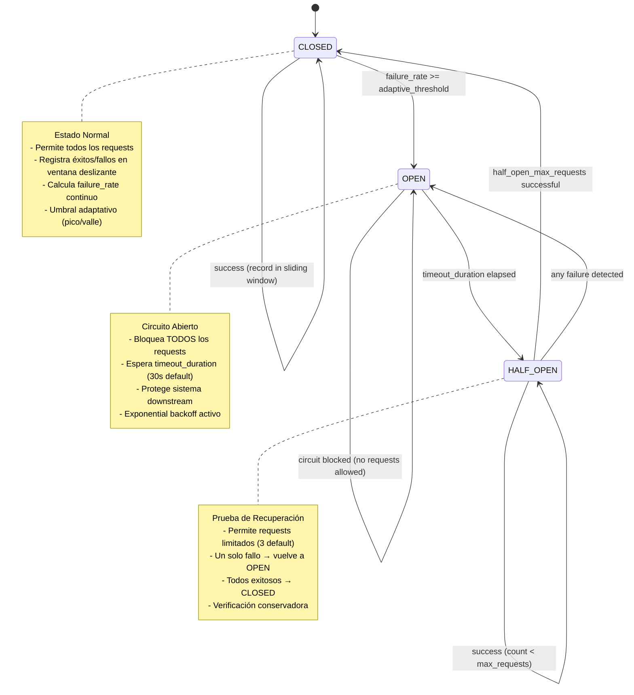
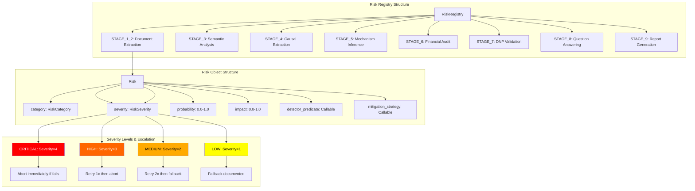
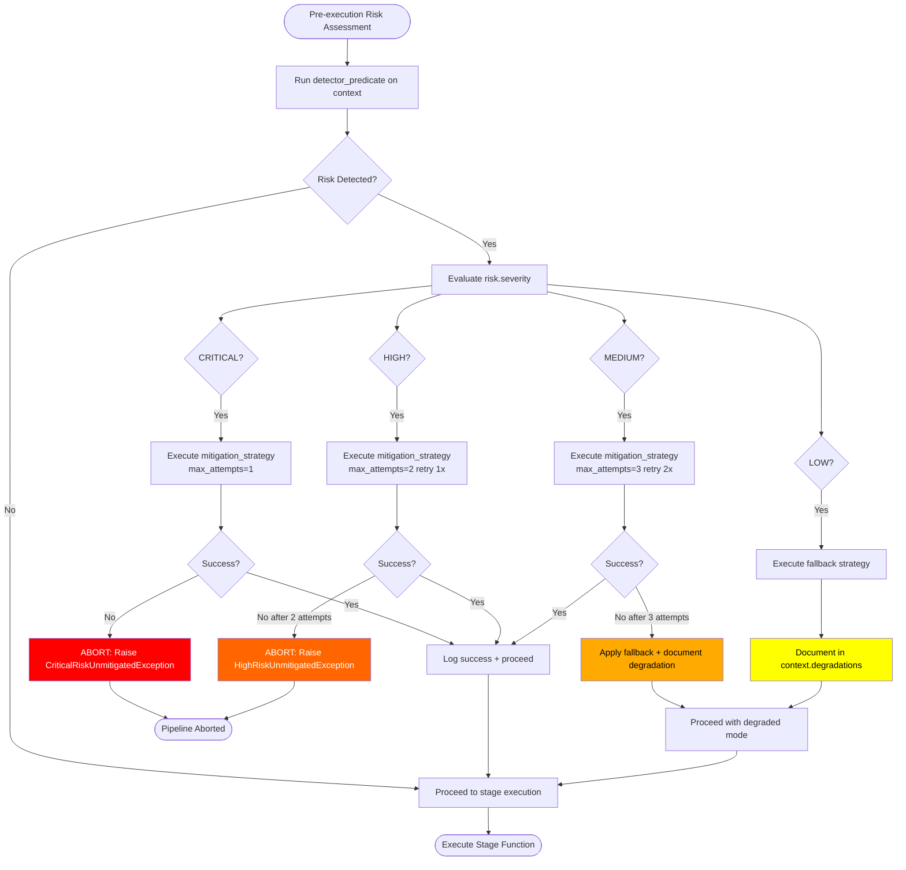
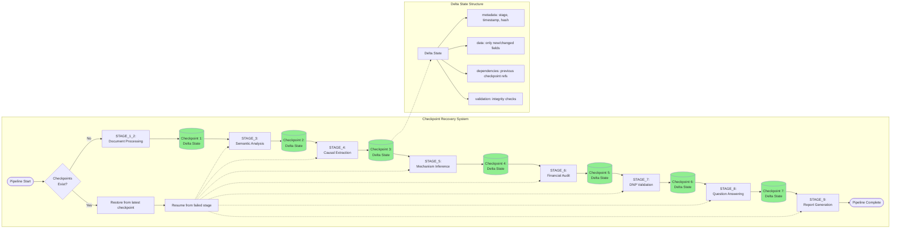

# FARFAN-2.0
Framework Avanzado de Reconstrucción y Análisis de Formulaciones de Acción Nacional 2.0

## Descripción

FARFAN-2.0 es un framework de grado industrial para la deconstrucción y auditoría causal de Planes de Desarrollo Territorial en Colombia, con énfasis en cumplimiento riguroso de estándares del DNP (Departamento Nacional de Planeación).

## Arquitectura de Resiliencia (Risk-Driven Resilience System)

FARFAN 2.0 implementa un sistema avanzado de resiliencia distribuida con patrones industriales para garantizar la robustez del pipeline de procesamiento. Este sistema incluye circuit breakers con ventanas deslizantes, evaluación de riesgos pre-ejecución, y recuperación incremental con checkpoints.

### Diagrama 1: Circuit Breaker - Transiciones de Estado con Ventana Deslizante

El Circuit Breaker protege contra fallos en cascada mediante tres estados con umbrales adaptativos según hora del día:



**Características de la Ventana Deslizante:**
- `window_size_seconds`: 60s (configurable)
- Limpieza automática de registros antiguos
- Cálculo de failure_rate en tiempo real
- Umbrales adaptativos:
  - **Horas pico** (8-18h): threshold × 1.5 (mayor tolerancia)
  - **Horas valle**: threshold × 0.8 (menor tolerancia)

### Diagrama 2: Risk Registry - Estructura con Niveles de Severidad

El Risk Registry organiza riesgos por etapa del pipeline con detectores y estrategias de mitigación:



**Categorías de Riesgo por Etapa:**
- **STAGE_1_2**: PDF_CORRUPTED, PDF_UNREADABLE, MISSING_SECTIONS, EMPTY_DOCUMENT
- **STAGE_3**: NLP_MODEL_UNAVAILABLE, TEXT_TOO_SHORT, ENCODING_ERROR
- **STAGE_4**: NO_CAUSAL_CHAINS, GRAPH_DISCONNECTED, INSUFFICIENT_NODES
- **STAGE_5**: BAYESIAN_INFERENCE_FAILURE, INSUFFICIENT_OBSERVATIONS
- **STAGE_6**: MISSING_BUDGET_DATA, BUDGET_INCONSISTENCY, NEGATIVE_ALLOCATIONS
- **STAGE_7**: DNP_STANDARDS_VIOLATION, COMPETENCIA_MISMATCH, MISSING_MGA_INDICATORS
- **STAGE_8**: INSUFFICIENT_EVIDENCE, MODULE_UNAVAILABLE
- **STAGE_9**: REPORT_GENERATION_FAILURE, DATA_SERIALIZATION_ERROR

### Diagrama 3: Flujo de Mitigación con Políticas de Escalación

El sistema ejecuta mitigación con retry adaptativo basado en severidad:



**Exponential Backoff para Dependencias Externas:**
- Intento 1: 0s delay
- Intento 2: 2^1 = 2s delay
- Intento 3: 2^2 = 4s delay
- Máximo: 30s delay con jitter aleatorio ±20%

### Diagrama 4: Checkpoint Recovery - Estados Incrementales Delta

El sistema persiste estados intermedios para recuperación sin re-procesamiento completo:



**Ventajas del Sistema de Checkpoints:**
- **Recuperación rápida**: Re-inicia desde último checkpoint exitoso
- **Estados delta**: Solo persiste cambios incrementales (ahorra espacio)
- **Integridad**: Validación de checksums y dependencias
- **Inmutabilidad**: Checkpoints son read-only después de creación

### Diagrama 5: Pipeline Completo con Risk Assessment Gates

Flujo completo del pipeline con gates de evaluación de riesgos pre-ejecución:

```mermaid
flowchart TB
    START([Input: PDF Document])
    START --> INIT[Initialize PipelineContext<br/>+ RiskRegistry<br/>+ CircuitBreaker]
    
    INIT --> GATE1{Risk Gate 1}
    GATE1 -->|Pass| S1[STAGE 1-2:<br/>Document Extraction<br/>+ Table Parsing]
    GATE1 -->|CRITICAL/HIGH Risk| ABORT1[Abort or Retry]
    
    S1 --> CB1{Circuit Breaker<br/>Check}
    CB1 -->|CLOSED| CP1[(Checkpoint 1)]
    CB1 -->|OPEN| WAIT1[Wait + Exponential Backoff]
    WAIT1 --> CB1
    
    CP1 --> GATE3{Risk Gate 3}
    GATE3 -->|Pass| S3[STAGE 3:<br/>Semantic Analysis<br/>NLP + spaCy]
    GATE3 -->|Risk Detected| MIT3[Mitigate<br/>Risk]
    MIT3 --> S3
    
    S3 --> CB3{Circuit Breaker}
    CB3 -->|CLOSED| CP2[(Checkpoint 2)]
    CB3 -->|OPEN/HALF_OPEN| BACKOFF3[Backoff]
    BACKOFF3 --> CB3
    
    CP2 --> GATE4{Risk Gate 4}
    GATE4 --> S4[STAGE 4:<br/>Causal Extraction<br/>Graph Construction]
    
    S4 --> CP3[(Checkpoint 3)]
    CP3 --> GATE5{Risk Gate 5}
    GATE5 --> S5[STAGE 5:<br/>Mechanism Inference<br/>Bayesian Analysis]
    
    S5 --> CP4[(Checkpoint 4)]
    CP4 --> GATE6{Risk Gate 6}
    GATE6 --> S6[STAGE 6:<br/>Financial Audit<br/>Budget Traceability]
    
    S6 --> CP5[(Checkpoint 5)]
    CP5 --> GATE7{Risk Gate 7}
    GATE7 --> S7[STAGE 7:<br/>DNP Validation<br/>Competencias + MGA + PDET]
    
    S7 --> CP6[(Checkpoint 6)]
    CP6 --> GATE8{Risk Gate 8}
    GATE8 --> S8[STAGE 8:<br/>Question Answering<br/>300 Questions]
    
    S8 --> CP7[(Checkpoint 7)]
    CP7 --> GATE9{Risk Gate 9}
    GATE9 --> S9[STAGE 9:<br/>Report Generation<br/>Micro/Meso/Macro]
    
    S9 --> VALIDATE[Validate All Outputs]
    VALIDATE --> END([Output: Reports + Diagrams])
    
    ABORT1 --> FAIL([Pipeline Failed])
    
    style GATE1 fill:#FFE4B5
    style GATE3 fill:#FFE4B5
    style GATE4 fill:#FFE4B5
    style GATE5 fill:#FFE4B5
    style GATE6 fill:#FFE4B5
    style GATE7 fill:#FFE4B5
    style GATE8 fill:#FFE4B5
    style GATE9 fill:#FFE4B5
    
    style CB1 fill:#87CEEB
    style CB3 fill:#87CEEB
    
    style CP1 fill:#90EE90
    style CP2 fill:#90EE90
    style CP3 fill:#90EE90
    style CP4 fill:#90EE90
    style CP5 fill:#90EE90
    style CP6 fill:#90EE90
    style CP7 fill:#90EE90
```



### Configuración del Sistema de Resiliencia

```python
from circuit_breaker import CircuitBreaker
from risk_mitigation_layer import RiskRegistry, RiskMitigationLayer, Risk, RiskSeverity, RiskCategory

# 1. Configurar Circuit Breaker
circuit_breaker = CircuitBreaker(
    failure_threshold=0.5,          # 50% failure rate para abrir circuito
    window_size_seconds=60,         # Ventana deslizante de 60 segundos
    timeout_duration=30,            # 30s en OPEN antes de HALF_OPEN
    half_open_max_requests=3,       # 3 requests de prueba en HALF_OPEN
    operation_timeout=10.0,         # 10s timeout por operación
    peak_hours=[8,9,10,11,12,13,14,15,16,17,18],  # Horas pico
    peak_multiplier=1.5,            # Mayor tolerancia en horas pico
    off_peak_multiplier=0.8         # Menor tolerancia en horas valle
)

# 2. Configurar Risk Registry
registry = RiskRegistry()

# Registrar riesgo de ejemplo
pdf_corrupted_risk = Risk(
    category=RiskCategory.PDF_CORRUPTED,
    severity=RiskSeverity.CRITICAL,
    probability=0.1,
    impact=1.0,
    detector_predicate=lambda ctx: not ctx.raw_text or len(ctx.raw_text) < 100,
    mitigation_strategy=lambda ctx: repair_pdf(ctx.pdf_path),
    description="PDF corrupto o ilegible"
)

registry.register_risk("STAGE_1_2", pdf_corrupted_risk)

# 3. Inicializar Risk Mitigation Layer
mitigation_layer = RiskMitigationLayer(registry)

# 4. Ejecutar etapa con protección completa
result = mitigation_layer.wrap_stage_execution(
    stage="STAGE_1_2",
    stage_function=extract_document_text,
    context=pipeline_context
)

# 5. Obtener estadísticas
circuit_stats = circuit_breaker.get_window_stats()
mitigation_report = mitigation_layer.get_mitigation_report()
```

### Beneficios del Sistema de Resiliencia

1. **Alta Disponibilidad**: Circuit breakers previenen fallos en cascada
2. **Recuperación Automática**: Retry con exponential backoff para dependencias transitorias
3. **Degradación Graciosa**: Fallback documentado para riesgos LOW/MEDIUM
4. **Trazabilidad Completa**: Logging estructurado de todos los eventos de riesgo
5. **Eficiencia**: Checkpoints evitan re-procesamiento completo tras fallos
6. **Observabilidad**: Métricas detalladas de salud del sistema

## Características Principales

### 1. **NUEVO: Sistema de Evaluación de 300 Preguntas**

El orquestador implementa un sistema completo de evaluación mediante **300 preguntas causales**:

- **30 Preguntas Base**: Organizadas en 6 dimensiones del Marco Lógico
  - D1: Insumos (Diagnóstico y Líneas Base)
  - D2: Actividades (Formalizadas)
  - D3: Productos (Verificables)
  - D4: Resultados (Medibles)
  - D5: Impactos (Largo Plazo)
  - D6: Causalidad (Teoría de Cambio)

- **10 Áreas de Política** (Decálogo):
  - P1: Derechos de las mujeres e igualdad de género
  - P2: Prevención de la violencia y protección frente al conflicto
  - P3: Ambiente sano, cambio climático, prevención y atención a desastres
  - P4: Derechos económicos, sociales y culturales
  - P5: Derechos de las víctimas y construcción de paz
  - P6: Derecho al buen futuro de la niñez, adolescencia, juventud
  - P7: Tierras y territorios
  - P8: Líderes y defensores de derechos humanos
  - P9: Crisis de derechos de personas privadas de la libertad
  - P10: Migración transfronteriza

**Cada respuesta incluye**:
- Texto de respuesta directa
- Argumento de nivel doctoral (2+ párrafos)
- Nota cuantitativa (0.0-1.0)
- Evidencia del documento
- Módulos que contribuyeron

**Reportes a 3 Niveles**:
1. **MICRO**: 300 respuestas individuales
2. **MESO**: 4 clústeres × 6 dimensiones
3. **MACRO**: Alineación global + análisis retrospectivo/prospectivo

### 2. Framework CDAF (Causal Deconstruction and Audit Framework)
- Extracción automática de jerarquías causales desde PDFs
- Análisis de mecanismos causales (Entidad-Actividad)
- Trazabilidad financiera
- Auditoría de operacionalización
- Generación de diagramas causales y matrices de responsabilidad

### 3. **NUEVO: Cumplimiento Integral de Estándares DNP**

#### Competencias Municipales
- **17 competencias** catalogadas según normativa colombiana
- Validación automática de competencias propias y concurrentes
- Base legal completa (Ley 136/1994, Ley 715/2001, Ley 1551/2012)
- 14 sectores de intervención cubiertos

#### Indicadores MGA
- **51 indicadores** del catálogo oficial MGA
  - 28 indicadores de producto
  - 23 indicadores de resultado
- Fórmulas de cálculo oficiales
- Fuentes de información verificadas
- Alineación con ODS (Objetivos de Desarrollo Sostenible)

#### Lineamientos PDET
- **17 lineamientos** para los 170 municipios PDET
- **8 pilares** del Acuerdo de Paz implementados
- Validación especial de participación comunitaria
- Requisitos de inversión rural (>60%)
- Alineación con PATR subregionales

## Instalación Paso a Paso

### Requisitos Previos

- **Python**: 3.11 o superior
- **Sistema Operativo**: Linux, macOS, o Windows 10+
- **Memoria RAM**: 4GB mínimo (8GB recomendado para procesamiento de documentos grandes)
- **Espacio en Disco**: 2GB para dependencias y modelos NLP
- **Herramientas adicionales**: 
  - Git
  - Graphviz (para generación de diagramas causales)

### Paso 1: Clonar el Repositorio

```bash
git clone https://github.com/kkkkknhh/FARFAN-2.0.git
cd FARFAN-2.0
```

### Paso 2: Crear Entorno Virtual (Recomendado)

```bash
# Crear entorno virtual
python3 -m venv farfan_env

# Activar entorno virtual
# En Linux/macOS:
source farfan_env/bin/activate

# En Windows:
farfan_env\Scripts\activate
```

### Paso 3: Instalar Dependencias Core

```bash
# Instalar todas las dependencias desde requirements.txt
pip install --upgrade pip
pip install -r requirements.txt
```

**Dependencias principales instaladas:**
- `pymupdf` - Extracción de texto y tablas desde PDFs
- `networkx` - Construcción y análisis de grafos causales
- `pandas` - Manejo de datos estructurados
- `spacy` - Procesamiento de lenguaje natural
- `pyyaml` - Configuración y metadatos
- `fuzzywuzzy` - Matching difuso de texto
- `python-Levenshtein` - Cálculo de distancias de edición
- `pydot` - Generación de diagramas con Graphviz
- `scipy` - Análisis estadístico
- `numpy` - Operaciones numéricas

### Paso 4: Descargar Modelo spaCy en Español

```bash
# Descargar modelo large de español (es_core_news_lg)
python -m spacy download es_core_news_lg
```

Este modelo incluye:
- Vectores de palabras entrenados (word embeddings)
- Reconocimiento de entidades nombradas (NER)
- Análisis sintáctico (dependency parsing)
- Lematización y POS tagging

### Paso 5: Instalar Graphviz (Opcional pero Recomendado)

**Ubuntu/Debian:**
```bash
sudo apt-get update
sudo apt-get install graphviz
```

**macOS (con Homebrew):**
```bash
brew install graphviz
```

**Windows:**
- Descargar desde https://graphviz.org/download/
- Agregar al PATH del sistema

### Paso 6: Verificar Instalación

```bash
# Verificar versión de Python
python --version

# Verificar instalación de dependencias
python -c "import pymupdf, networkx, pandas, spacy; print('Core dependencies OK')"

# Verificar modelo spaCy
python -c "import spacy; nlp = spacy.load('es_core_news_lg'); print('spaCy model OK')"

# Verificar Graphviz
python -c "import pydot; print('Graphviz OK')"
```

### Paso 7: Ejecutar Tests de Validación

```bash
# Test de notación canónica
python -m unittest test_canonical_notation.py

# Test de circuit breaker
python -m unittest test_circuit_breaker.py

# Test de capa de mitigación de riesgos
python test_risk_mitigation.py
```

Todos los tests deben pasar sin errores.

### Paso 8: Configuración Opcional - Redis (Para Sistemas Distribuidos)

Si planea usar el Circuit Breaker con sincronización distribuida:

```bash
# Instalar Redis
sudo apt-get install redis-server

# Instalar cliente Python
pip install redis

# Iniciar servicio Redis
sudo systemctl start redis
```

## Implementación del Sistema Completo

### Uso Básico: Procesamiento de un Plan de Desarrollo

```bash
# Procesar un PDM con todas las etapas del pipeline
python orchestrator.py plan_desarrollo_municipal.pdf \
    --policy-code PDM2024-ANT-MED \
    --output-dir ./resultados_evaluacion

# Para municipio PDET (con lineamientos especiales)
python orchestrator.py plan_desarrollo_pdet.pdf \
    --policy-code PDM2024-CAU-PAT \
    --output-dir ./resultados_pdet \
    --pdet
```

### Uso Avanzado: Configuración Personalizada

```bash
# Con logging detallado
python orchestrator.py documento.pdf \
    --policy-code PDM2024 \
    --output-dir ./salida \
    --log-level DEBUG

# Solo procesamiento CDAF (sin orquestación completa)
python dereck_beach documento.pdf \
    --output-dir ./resultados_cdaf \
    --policy-code PDM2024 \
    --pdet
```

### Demostración Interactiva

```bash
# Ejecutar demo simplificado del sistema de orquestación
python demo_orchestrator.py --simple

# Ejecutar ejemplos de validación DNP
python ejemplo_dnp_completo.py
```

### Validación DNP Programática

```python
from dnp_integration import ValidadorDNP

# Inicializar validador para municipio PDET
validador = ValidadorDNP(es_municipio_pdet=True)

# Validar proyecto integral
resultado = validador.validar_proyecto_integral(
    sector="educacion",
    descripcion="Construcción de 5 sedes educativas rurales",
    indicadores_propuestos=["EDU-020", "EDU-021"],
    presupuesto=2_000_000_000,
    es_rural=True,
    poblacion_victimas=True
)

# Generar reporte de cumplimiento
print(validador.generar_reporte_cumplimiento(resultado))
```

### Estructura de Salida

Después de la ejecución, el directorio de salida contendrá:

```
resultados_evaluacion/
├── micro_report_PDM2024-ANT-MED.json       # 300 respuestas individuales
├── meso_report_PDM2024-ANT-MED.json        # 4 clústeres × 6 dimensiones
├── macro_report_PDM2024-ANT-MED.json       # Evaluación global
├── macro_report_PDM2024-ANT-MED.md         # Reporte en Markdown
├── PDM2024-ANT-MED_causal_diagram.png      # Diagrama causal
├── PDM2024-ANT-MED_accountability_matrix.md # Matriz de responsabilidades
├── PDM2024-ANT-MED_confidence_report.json  # Reporte de confianza
├── PDM2024-ANT-MED_causal_model.json       # Modelo causal estructurado
└── PDM2024-ANT-MED_dnp_compliance_report.txt # Cumplimiento DNP
```

## Uso Rápido

### Sistema de Orquestación Completo (NUEVO)

El orquestador integra **todos los módulos** para evaluar planes mediante **300 preguntas**:

```bash
# Procesar un plan de desarrollo
python orchestrator.py plan_desarrollo.pdf \
    --policy-code PDM2024-ANT-MED \
    --output-dir ./resultados \
    --pdet

# Demostración del sistema
python demo_orchestrator.py --simple
```

**Salida generada**:
- `micro_report_{code}.json` - 300 respuestas individuales
- `meso_report_{code}.json` - 4 clústeres × 6 dimensiones
- `macro_report_{code}.json/md` - Evaluación global

Ver [ORCHESTRATION_README.md](ORCHESTRATION_README.md) para documentación completa.

### Validación DNP Standalone

```python
from dnp_integration import ValidadorDNP

validador = ValidadorDNP(es_municipio_pdet=True)

resultado = validador.validar_proyecto_integral(
    sector="educacion",
    descripcion="Construcción de 5 sedes educativas en zona rural",
    indicadores_propuestos=["EDU-020", "EDU-021", "EDU-002"],
    presupuesto=2_000_000_000,
    es_rural=True,
    poblacion_victimas=True
)

print(validador.generar_reporte_cumplimiento(resultado))
```

### Framework Completo CDAF

```bash
# Procesamiento estándar
python dereck_beach documento.pdf --output-dir resultados/ --policy-code PDM2024

# Procesamiento para municipio PDET
python dereck_beach documento.pdf --output-dir resultados/ --policy-code PDM2024 --pdet
```

### Ejemplos Interactivos

```bash
# Ejecutar ejemplos completos
python ejemplo_dnp_completo.py
```

## Módulos

### **NUEVO: Sistema de Orquestación Integral**
- `orchestrator.py` - Orquestador principal con flujo canónico de 9 etapas
- `question_answering_engine.py` - Motor de respuesta a 300 preguntas
- `report_generator.py` - Generador de reportes micro, meso y macro
- `module_choreographer.py` - Coreógrafo de módulos y acumulador de respuestas

### Módulos DNP (Nuevos)
- `competencias_municipales.py` - Catálogo de competencias municipales
- `mga_indicadores.py` - Catálogo de indicadores MGA
- `pdet_lineamientos.py` - Lineamientos PDET
- `dnp_integration.py` - Integración y validación DNP
- `canonical_notation.py` - **NUEVO:** Sistema canónico de notación (P#-D#-Q#)
- `ejemplo_dnp_completo.py` - Ejemplos de uso

### Módulos Framework Principal
- `dereck_beach` - Framework CDAF principal
- `initial_processor_causal_policy` - Procesador de políticas causales
- `teoria_cambio_validacion_monte_carlo` - Validación de teoría de cambio
- `guia_cuestionario` - Cuestionario de validación causal

## Salidas Generadas

El framework genera automáticamente:

1. **{policy_code}_causal_diagram.png** - Diagrama causal visual
2. **{policy_code}_accountability_matrix.md** - Matriz de responsabilidades
3. **{policy_code}_confidence_report.json** - Reporte de confianza
4. **{policy_code}_causal_model.json** - Modelo causal estructurado
5. **{policy_code}_dnp_compliance_report.txt** - **NUEVO:** Reporte de cumplimiento DNP

## Documentación

- [DNP Integration Documentation](DNP_INTEGRATION_DOCS.md) - Guía completa de validación DNP
- [Canonical Notation Documentation](CANONICAL_NOTATION_DOCS.md) - **NUEVO:** Sistema canónico de notación
- Ver ejemplos en `ejemplo_dnp_completo.py`

## Estándares y Normativa

### Competencias Municipales
- Constitución Política de Colombia (1991)
- Ley 136 de 1994 - Organización Municipal
- Ley 715 de 2001 - Sistema General de Participaciones
- Ley 1551 de 2012 - Modernización Municipal

### Indicadores MGA
- DNP - Metodología General Ajustada (MGA)
- Sistema de Seguimiento a Proyectos de Inversión (SPI)

### PDET
- Decreto 893 de 2017 - Creación de PDET
- Acuerdo Final para la Terminación del Conflicto (2016)
- Agencia de Renovación del Territorio (ART)

## Niveles de Cumplimiento DNP

- **EXCELENTE**: >90% - Cumplimiento sobresaliente
- **BUENO**: 75-90% - Cumplimiento adecuado
- **ACEPTABLE**: 60-75% - Cumplimiento mínimo
- **INSUFICIENTE**: <60% - Requiere mejoras

## Contribuciones

Este proyecto implementa estándares oficiales del DNP y el Acuerdo de Paz de Colombia. Las contribuciones deben mantener estricta adherencia a la normativa colombiana vigente.

## Licencia

Ver archivo LICENSE

## Contacto

Para soporte sobre estándares DNP:
- DNP: https://www.dnp.gov.co
- ART: https://www.renovacionterritorio.gov.co

